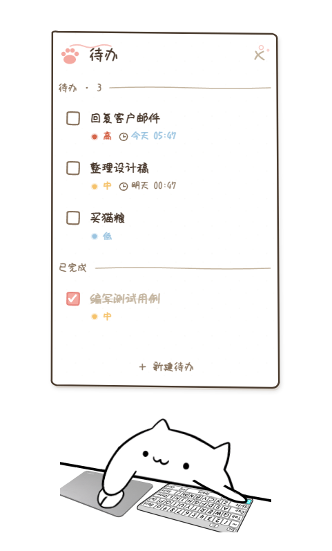
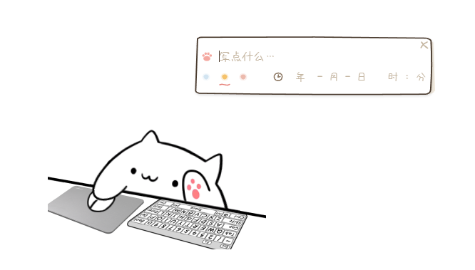

<div align="center">

# BongoCat Todo

[BongoCat](https://github.com/ayangweb/BongoCat) 桌宠的 fork，新增了手绘风格的待办功能——右键桌宠即可打开待办面板。

</div>

<div align="center">
  <div>
    <a href="https://github.com/ChHsiching/bongocat-todo/releases"></a>
    <a href="https://github.com/ChHsiching/bongocat-todo/releases"></a>
    <a href="https://github.com/ChHsiching/bongocat-todo/releases"></a>
  </div>

  <p>
    <a href="./LICENSE"></a>
    <a href="https://github.com/ChHsiching/bongocat-todo/releases/latest"></a>
    <a href="https://github.com/ChHsiching/bongocat-todo/releases"></a>
  </p>
</div>

| 待办面板 | 快速新建 |
| --- | --- |
|  |  |

## 简介

BongoCat Todo 是 [BongoCat](https://github.com/ayangweb/BongoCat) 的 fork，在原版桌宠的基础上新增了一个手绘风格的待办模块。

原版 BongoCat 是一只会跟着你敲键盘、动鼠标的桌宠。BongoCat Todo 让它不只是看着你做事——右键桌宠呼出待办面板，记下接下来要干嘛，到点了还会提醒你。

### 待办模块功能

- **伴随面板**：贴在桌宠旁边的独立窗口，手绘纸张风格（851 手写字体 + SVG 图元）
- **待办管理**：新建、勾选完成、删除，数据自动持久化，重启不丢
- **优先级**：低 / 中 / 高三档，手绘墨点配色区分（蓝 / 橙 / 红）
- **截止日期**：设定年月日时分，到期系统通知提醒
- **快速新建**：迷你输入窗跟随桌宠，不用打开主面板也能记一条
- **自动排序**：按优先级和截止日期排列

### 原版 BongoCat 功能

- 跟随键盘、鼠标或手柄操作同步动作
- 支持导入自定义 Live2D 模型
- 适配 macOS、Windows 和 Linux
- 完全开源，离线运行，不收集数据

## 下载

前往 [GitHub Releases](https://github.com/ChHsiching/bongocat-todo/releases) 下载最新版本。

不确定下载哪个？参考[下载指南](.github/DOWNLOAD_GUIDE.md)。

## 开发

### 环境要求

- Node.js 20+ / pnpm
- Rust stable（`rustup`）
- 各平台 Tauri 2 依赖（macOS: Xcode CLT；Windows: WebView2 + MSVC；Linux: `libwebkit2gtk-4.1-dev` 等）

### 本地启动

```bash
pnpm install
pnpm tauri dev
```

### 测试与构建

```bash
pnpm test        # 单元测试
pnpm build       # 构建
pnpm lint        # 代码检查
```

## 更多模型

原版 BongoCat 社区维护了一个模型合集，可以下载更多猫咪形象：

📦 [Awesome-BongoCat](https://github.com/ayangweb/Awesome-BongoCat)

## 致谢

本项目基于 [ayangweb/BongoCat](https://github.com/ayangweb/BongoCat) 开发，感谢原作者的贡献。灵感来源于 [MMmmmoko](https://github.com/MMmmmoko) 的 [Bongo-Cat-Mver](https://github.com/MMmmmoko/Bongo-Cat-Mver)。

## License

继承上游 License，见 [LICENSE](./LICENSE)。
